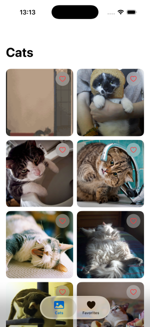
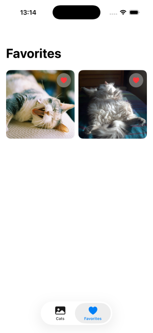
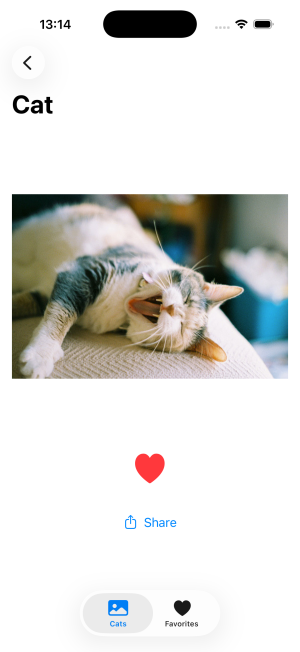

# Cat Image App 🐱

猫画像を一覧で閲覧し、お気に入り登録・管理ができるiOSアプリです。  
APIから画像を取得し、お気に入り機能を実装しています。

---

## ■ アプリ概要
猫の画像を一覧表示し、気に入った画像をお気に入り登録できるシンプルなアプリです。  
SwiftUIの基本構成（MVVM・状態管理・非同期通信）を意識して実装しました。

---

## ■ 機能
- 猫画像一覧表示（API取得）
- お気に入り登録 / 削除
- お気に入り一覧表示
- Pull to Refresh対応
- 詳細画面表示

---

## ■ 使用技術
- SwiftUI（UI構築）
- MVVMアーキテクチャ
- async / await（非同期通信）
- UserDefaults（ローカル保存）
- REST API（The Cat API）

---

## ■ 工夫した点
- AsyncImageの再描画問題に対して独自のImageLoaderを実装し安定化
- LazyVGridのレイアウト崩れを固定サイズ設計で解決
- SwiftUIのView再利用による不具合をid管理で制御
- SwiftUIの学習やAPI連携のサンプルとしても活用できます。

---

## ■ 苦労した点
- 画像の縦横比によるUI崩れや重なり問題の解決
- SwiftUIのView再利用（id管理）による表示不具合の対応
- AsyncImageのキャッシュ挙動による画像未表示問題
- 画面間での状態共有をViewModelで一元管理し、即時反映を実現

---

## ■ 今後の改善点
- 画像キャッシュの最適化（パフォーマンス向上）
- アニメーションの追加
- CoreDataへの移行
- ダークモード対応

---

## ■ 実行方法
1. 本リポジトリをクローン
2. Xcodeでプロジェクトを開く
3. APIキーを設定（The Cat API）
4. ビルド・実行

※ APIキーは含まれていません。

---

## ■ 補足
実務を想定し、UI/UXと状態管理の安定性を意識して開発しました。

---
