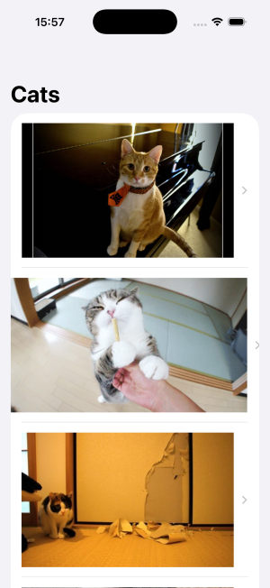
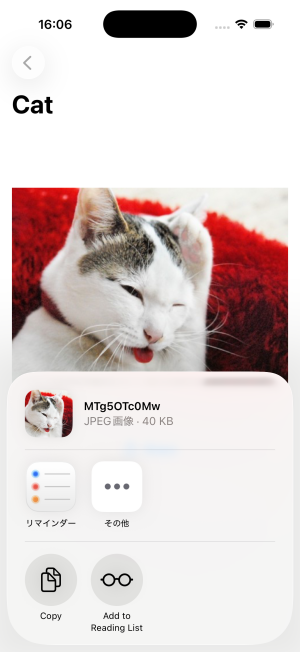

## SwiftUI Cat Image App

猫画像APIを使用したサンプルアプリです。  
ボタンを押すとAPIから猫画像を取得して表示します。

## Tech Stack
- Swift  
- SwiftUI  
- MVVM  
- Async/Await  
- URLSession  
- JSONDecoder

## Architecture
MVVM

## State Management
- @StateObject
- ObservableObject
- @Published

## Features
- Fetch cat images from API  
- List view with SwiftUI  
- Pull to refresh  
- Loading indicator  
- Detail view for each cat image  

## Screenshot

  
  

